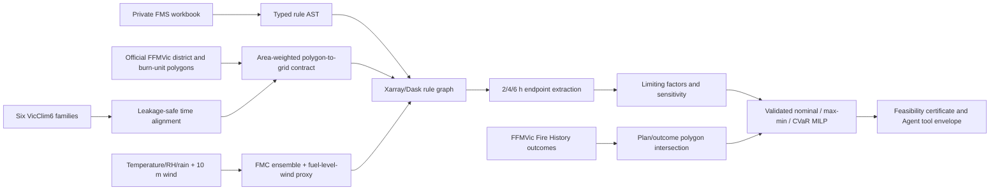

# Wildfire Burn-window Decision Support

Deterministic domain tools that turn gridded fire-weather data and expert
prescriptions into auditable candidate windows, explanations, sensitivity
scenarios and feasible schedules. The project is designed as a **trusted tool
layer for an AI agent**: an LLM may choose a tool, but it cannot invent weather
rules, bypass missing-data policy or return an infeasible schedule.

## Why this project exists

The product question is how a planner or Agent can turn expert prescriptions,
multi-decadal weather data, official burn-unit records and resource assumptions
into an auditable shortlist of candidate windows and feasible schedules. The
engineering question is how to make that decision chain reproducible at the
file-backed VicClim6 scale (1973–2023, approximately 4 km) without letting an LLM
invent rules, measurements or economic outcomes.

This repository complements a multimodal-search/Agent portfolio by demonstrating
the part that must remain deterministic: typed tools, explicit constraints,
large-array execution, provenance and refusal to guess unresolved semantics.



The difficult part is not reading a NetCDF file. It is preserving the meaning
of daily and hourly state across 51 annual checkpoints while keeping every
omitted rule and failed assumption visible. A year is publishable only when its
data kind, Git SHA, workbook hash, coverage, warnings and output hashes pass the
same aggregation gate.

The authorised Group44 data area contains the six climate/index families but
no region polygon or burn-unit geometry. The first full-grid array
therefore labels all 148 x 244-cell results as a **statewide exposure screen
under that partial rule set**, not a Murray Goldfields estimate. A separate,
official Victorian Government `LF_DISTRICT` ArcGIS layer is now fetched by an
exact district-name query and applied at VicClim6 grid-cell centres. Regional
and statewide artifacts are never mixed by the aggregation quality gate. The
district mask is still not a burn-unit boundary. A separate official JFMP/Fire
History adapter now queries **176 current Murray Goldfields burn IDs** and
**187 historical burn IDs**, aligns eight shared IDs and measures plan/outcome
polygon overlap in EPSG:3577. This outcome layer is kept separate from the
  historical district weather screen. All 176 current-plan IDs now also have a
  reproducible area-weighted VicClim6 grid contract; the 51-year weather results
  remain district-level until a separate burn-unit climatology run is completed.
  See [boundary provenance](docs/boundary-data.md).

## Stable tool contracts

All six public tools return a `ToolEnvelope` containing status, data version,
source, active constraints, warnings and a typed result.

| Tool | Deterministic responsibility |
|---|---|
| `find_burn_windows` | Evaluate an AND-rule and extract continuous 2/4/6-hour runs |
| `explain_limiting_factors` | Attribute all and exclusive rule failures |
| `compare_threshold_scenarios` | Compare explicit threshold perturbations with a fixed baseline |
| `get_region_trend` | Report Theil–Sen slope and seeded block-bootstrap interval |
| `optimize_burn_schedule` | Compare two greedy baselines with a validated binary programme, machine-checkable feasibility/solver certificates, local rejection reasons and discrete crew-capacity counterfactuals |
| `derive_fuel_inputs` | Produce a dry-fuel FMC model ensemble and explicit 10-m-to-fuel-level wind scenario with rain guards and provenance |

The Pydantic schemas are in `src/burnwindows/models.py`; JSON Schema can be
generated directly with `ToolEnvelope.model_json_schema()` and the request
models used by a calling service.

The HTTP layer exposes `GET /api/tools`, `POST /api/tools/{tool_name}:invoke`,
`POST /api/jobs/burn-unit-climatology`, `GET /api/jobs/{job_id}`, and
`GET /metrics`. Undeclared fields and unknown tools fail before execution. The
optional Model Studio planner may select exactly one declared tool and fill its
typed arguments; it cannot submit SQL, Dask graphs, optimiser expressions or
an arbitrary filesystem path.

## Technical design

- **Rule AST:** every usable workbook value becomes a typed bound; anything not
  safely interpretable is retained in `unresolved`, never silently dropped.
- **Time alignment:** date-labelled daily data defaults to a 24-hour availability
  lag and backward-only fill. Using a value earlier requires an explicit source
  guarantee that its timestamp is its availability time. Naive timestamps require
  an explicit source timezone; ambiguous or nonexistent DST wall times fail.
- **Units:** conversion occurs only when NetCDF attributes explicitly declare
  Kelvin, fractional humidity or metres/second. Unknown units produce warnings.
- **Missing data:** callers choose `error`, `fail` or `ignore`; the default is
  `error`. Unmapped fuel/ground-wind constraints are excluded with warnings
  unless the caller explicitly includes them.
- **Fuel-input closure:** `--derive-fuel-proxies` evaluates the two previously
  absent surface-FMC and fuel-level-wind inputs using a Viney/Van Wagner-Pickett
  ensemble, rain guard and explicit wind-reduction factor. These are labelled
  meteorological proxies rather than site observations.
- **Burn-unit outcomes:** official JFMP and Fire History records are paginated,
  hashed, de-duplicated by typed record, joined on the official burn ID and
  intersected in Australian Albers. Attribute ratios and geometry overlap are
  both retained so staged/partially completed burns remain visible.
- **Scale:** Xarray/Dask evaluation stays lazy until metrics are computed.
  NetCDF, Zarr and Kerchunk references share one input adapter.
- **Spatial scope:** an optional, single-feature EPSG:4326 GeoJSON polygon is
  converted to a selected `spatial_cell` axis before evaluation. The exact file
  hash, official feature properties, simplification tolerance and inclusion
  rule are retained; empty or ambiguous scopes fail closed.
- **Burn-unit overlay:** current-plan polygons are unioned by official
  `TREAT_NO`, projected to EPSG:3577 and intersected with the rectilinear grid.
  Weights are overlap area divided by grid-cell area. Zero-coverage units remain
  explicit failures; nearest-cell substitution is forbidden.
- **Scheduling:** candidate windows are binary variables with resource and daily
  capacity constraints. The decision layer now compares nominal, max-min and
  lower-tail CVaR formulations; every solver output is independently validated.
  The Agent-facing nominal tool also reports which selected windows block each
  rejected candidate and a one-step crew-capacity frontier. Those diagnostics
  are explicitly not LP duals, causal effects or financial marginal values.

See [architecture](docs/architecture.md), [decision log](docs/decisions.md) and
[evidence ledger](docs/evidence.md).

## Quick start

```bash
python -m venv .venv
python -m pip install -e ".[dev,kerchunk]"
pytest
```

The private prescription workbook remains outside Git:

```bash
burn-window inspect --prescriptions /restricted/FMS-Prescriptions_2.xlsx
```

Create a deterministic **synthetic** smoke-test input:

```bash
python scripts/generate_synthetic_fixture.py --output data/synthetic.nc
burn-window inspect \
  --prescriptions /restricted/FMS-Prescriptions_2.xlsx \
  --input data/synthetic.nc
```

Run one real-data slice only after confirming field semantics and units:

```bash
burn-window analyse \
  --prescriptions /restricted/FMS-Prescriptions_2.xlsx \
  --input /restricted/VicClim6 \
  --backend vicclim6 \
  --burn-class "<exact class name>" \
  --start 2020-01-01T00:00:00 \
  --end 2020-12-31T23:00:00 \
  --durations 2 4 6 \
  --missing-policy error \
  --derive-fuel-proxies \
  --wind-reduction-factor 0.33 \
  --data-kind real \
  --output-dir artifacts/run-001
```

Fetch the current official Murray Goldfields burn-unit/outcome evidence without
persisting the raw service payload:

```bash
burn-window official-outcomes \
  --planned-district "Murray Goldfields" \
  --history-district "Loddon Mallee - Murray Goldfields" \
  --output-dir artifacts/public/ffmvic_murray_goldfields_burn_delivery_20260822
```

Build the official burn-unit/grid contract and start the trusted tool service:

```bash
burn-window build-burn-unit-overlay \
  --grid /restricted/VicClim6/2020/01/IDV71000_VIC_T_SFC.nc \
  --where "DISTRICT='Murray Goldfields'" \
  --output-dir artifacts/burn-unit-overlay

burn-window serve-tools \
  --artifact-catalog configs/public-artifact-catalog.json \
  --host 0.0.0.0 --port 8000
```

### Verified official burn-unit and outcome integration

The public FFMVic JFMP and Fire History services returned **221 plan features
(176 burn IDs)** and **430 historical features (187 burn IDs)** for Murray
Goldfields. Exact official-ID alignment found **eight shared burn units**. Their
current plan polygons cover **422.16 ha** and the matched historical treatment
polygons cover **162.56 ha**; **161.89 ha intersect**, equal to **38.35% of the
plan geometry** and **99.59% of the treated geometry**. The calculation uses
GeoJSON feature hashes and EPSG:3577 Australian Albers, and independently
recomputes geometry area rather than trusting display values.

The same artifact records two transparent planning inputs: FFMVic's public
20/30/70-person crew scenarios and the 2024–25 statewide direct planned-burning
benchmark of **AUD 26.7m / 92,473 ha = AUD 288.73 per treated hectare**. Applied
to the matched 162.54 attribute hectares this is an **AUD 46,931 direct-cost
scale proxy**—not a unit's observed cost, saving or ROI. These data now support
burn-unit, treated-area, resource-scenario and cost-scale discussion while
remaining separate from safety and causal risk-reduction claims. See the
[machine-readable artifact](artifacts/public/ffmvic_murray_goldfields_burn_delivery_20260822.json).

### Verified burn-unit to VicClim6 spatial contract

Spartan job `29584607` unioned 221 official Murray Goldfields current-plan
features into **176 unique `TREAT_NO` units** and intersected them with the
148×244 VicClim6 grid in Australian Albers. All 176 units had explicit coverage,
producing 351 non-zero polygon/cell weights and zero nearest-cell fallbacks. The
job completed in five seconds on one CPU with 101,860 KiB MaxRSS; the source
GeoJSON, representative grid, manifest and compact result are hash-pinned.

This closes the burn-unit **spatial-contract** gap only. It does not turn the
existing district-level 51-year weather screen into burn-unit climatology and
does not prove safety, risk reduction or economic return. See the
[compact run record](artifacts/public/vicclim6_murray_goldfields_burn_unit_overlay_20260825.json).

Every analysis emits `run_manifest.json`, `metrics.json` and
`error_cases.json`. The manifest captures git SHA, input hashes where practical,
configuration, hardware, Slurm IDs and whether the run used real or synthetic
data.

### Verified real-data complete-condition proxy chain

Spartan job `29504538` evaluated the selected Murray Goldfields prescription
over all **19,509,264** 2020 district space-time cells. Unlike the earlier
six-condition screen, it evaluated all **eight compiled conditions** by adding
the explicit FMC ensemble and fuel-level-wind scenario. It retained **481,733
cells (2.4693%)** and found **193,450 / 36,245 / 7,622** endpoints meeting the
2/4/6-hour continuity thresholds. The compute step completed in 73 seconds with
792,724 KiB MaxRSS.

This closes the software/data-input gap, not the field-validation gap. The FMC
value is a Viney/Van Wagner--Pickett model ensemble, ground wind uses a declared
0.33 reduction factor, and VicClim6 has no precipitation field, so the rain
guard could not be applied. The result is therefore a complete compiled-rule
**proxy evaluation**, not an on-site measurement, safe-burn approval or causal
outcome. See the [redacted run record](artifacts/public/vicclim6_murray_goldfields_proxy_complete_2020_29504538.json).

The production-shaped chain then ran the same compiled prescription across all
**51 file-backed years (1973–2023)**. Spartan array `29504645` completed **51/51
annual checkpoints** and dependent aggregate `29504810` passed the exact-SHA,
spatial-contract, prescription-contract and proxy-contract gates. It evaluated
**992,840,304 district cell-hours** with all **8/8 conditions**, retained
**24,273,000 cells (2.4448%)**, and produced **9,919,639 / 2,253,645 / 533,488**
2/4/6-hour endpoints. Annual tasks used 2,513 summed task-seconds with 0.89 GiB
peak step RSS; the enhanced aggregate completed in seven seconds.

The descriptive Theil–Sen change is **+0.221 percentage points per decade**
(five-year moving-block-bootstrap 95% interval **+0.010 to +0.413**). It is a
non-causal property of this proxy contract, not evidence that burns became safer
or more effective. The [redacted 51-year record](artifacts/public/vicclim6_murray_goldfields_proxy_complete_51y_29504645.json)
contains the annual series, condition attribution, source provenance, code SHAs
and Slurm accounting without publishing restricted NetCDF or workbook content.

Run the deterministic operations benchmark:

```bash
burn-window decision-benchmark --repetitions 30 --held-out-scenarios 200 \
  --output-dir artifacts/decision-benchmark
```

The verified synthetic run, refreshed on 2026-08-20, evaluated 30 seeded
candidate sets and 6,000 held-out uncertainty scenarios per policy. CVaR used
40 separately seeded planning scenarios per run, so evaluation scenarios never
entered its objective. All greedy, nominal, max-min and CVaR MILP outputs were
independently feasible. Nominal MILP improved mean
scenario utility over the best greedy by 1.79% (paired-seed bootstrap mean 95%
interval 0.91%–2.77%). Robust MILP reduced mean mobilisation-penalty units by
2.55%, but its held-out P05 utility interval crossed zero relative to nominal
MILP. CVaR improved mean held-out P05 utility by 1.42% versus nominal (paired-seed
bootstrap mean 95% interval 0.25%–3.25%); 60% of runs selected the same policy,
so this is a bounded average tail-utility result rather than universal dominance.
These are synthetic utility units, not dollars, realised area or fire-risk reduction.

Every nominal, max-min and CVaR result now carries two separate audit records:
an independent primal certificate that recomputes the selected objective and
all crew/day constraints, and the HiGHS branch-and-bound proof metadata
(optimality status, relative MIP gap, objective bound and node count). The
former verifies feasibility; only the latter can support an optimality claim.

## Spartan execution

The confirmed team source is
`/data/gpfs/projects/punim1257/Group44/data/raw/VicClim6`; the canonical access
probe is
`WRFV6_TSFC1972-2024/2020/01/IDV71000_VIC_T_SFC.nc`. An authorised `punim1257`
team identity passed the read gate on 21 August 2026. Exact-SHA inventory job
`29483795` found six families, 3,672 monthly NetCDF files and
263,698,792,008 bytes (245.59 GiB). All families contain 51 actual year
directories, **1973–2023**; the `1972-2024` strings are directory labels rather
than this GPFS copy's coverage. The compact
[inventory/2020 pilot record](artifacts/public/vicclim6_inventory_2020_pilot_20260821.json)
publishes hashes and boundaries without copying the workbook or climate data.

`spartan/` contains an Apptainer definition and restartable Slurm jobs:

- `build_image.sbatch` builds the versioned runtime;
- `run_real_preflight.sbatch` inventories collection scale and three
  representative NetCDF headers in a 15-minute, 2-CPU gate;
- `build_kerchunk.sbatch` creates references without copying climate payloads;
- `run_vicclim6_year_array.sbatch` runs the real 1973–2023 collection with one
  exact-SHA checkpoint per year, five hours of prior context at normal year
  boundaries and an explicit 24-hour left-censor in 1973;
- `aggregate_vicclim6_years.sbatch` refuses to merge incomplete, mixed-commit,
  mixed-prescription or non-real annual artifacts and adds a seeded Theil–Sen /
  moving-block-bootstrap descriptive trend;
- `run_full_pipeline.sbatch` remains the older Apptainer template and is not the
  evidence-producing 2026 array;
- `run_scaling_benchmark.sbatch` compares 1/2/4 workers on a clearly labelled
  deterministic synthetic benchmark.
- `run_vicclim6_real_scaling.sbatch` runs a checkpointed 1/2/4-thread comparison
  on one pinned real region/year/rule workload; the comparator rejects semantic
  drift, mixed or unknown run SHAs and restricted source paths.
- `run_arco_era5_preflight.sbatch` reads a bounded Victoria slice from the
  anonymous public ARCO-ERA5 Zarr store and verifies the real-data I/O and
  meteorological-derivation path without copying the source collection.
- `run_public_weather_screen.sbatch` streams the public weather-only screen in
  configurable time chunks. Its JSON checkpoint preserves per-cell unfinished
  run lengths, monthly counts and constraint failures, so 2/4/6-hour runs remain
  exact across chunk and restart boundaries.
- `run_public_weather_restart_gate.sbatch` compares one uninterrupted 336-hour
  public-data run with a controlled exit-75 plus resume run and requires an
  exact semantic hash match. Spartan job `29467567` completed at exact commit
  `6eb8c5f`: the controlled run stopped after 168/336 hours, resumed from its
  checkpoint, and matched the uninterrupted run with semantic SHA-256
  `6e13387b...205a` over 316,848 cell-hours. The compact
  [restart-gate record](artifacts/public/arco_era5_restart_gate_29467567.json)
  preserves the job, hashes, runtime and boundary without copying the Zarr data.

Set the required environment variables shown at the top of each script. Raw
climate data, source prescriptions, Kerchunk paths and analysis outputs stay on
restricted project storage.

### Verified 51-year statewide grid screen

Spartan array `29484660` and dependent aggregate `29484661` completed all
**51 file-backed years (1973–2023)** at exact commit `2949d5e`. The aggregate
quality gate verified one Git SHA, one prescription contract, real data, all
expected years and no raw paths. Across the complete 148 x 244 grid it evaluated
**16,142,930,688 space-time cells** under six mapped conditions for the
`Murray Goldfields - Box ironbark forest` workbook class; surface fuel moisture
and ground wind remain explicitly unmapped. The partial screen retained
**546,834,850 cells (3.3875%)**; 2/4/6-hour continuous-window endpoints were
**312,292,203 / 100,055,299 / 32,758,474**.

The 51 one-CPU annual tasks completed in 276–625 seconds, with 19,005 seconds of
summed task runtime and 7,423,104 KiB maximum observed RSS; aggregation took
eight seconds. A Theil–Sen descriptive trend with a seeded five-year
moving-block residual bootstrap estimated **+0.208 percentage points per
decade** (95% interval **+0.015 to +0.390**). This is a descriptive association
for one partial rule and statewide grid contract, not causal attribution. It is
also not a Murray Goldfields result: the workbook class was evaluated across
every grid cell without a burn-unit, tenure, access or treatable-area mask.

The [compact public record](artifacts/public/vicclim6_statewide_51y_29484660.json)
contains the exact code/input/summary hashes and Slurm accounting without the
restricted workbook, NetCDF payloads, raw paths or annual artifacts. Passes are
not burn approvals, complete prescriptions, safe hours, treated area,
fire-risk reduction or economic value.

### Verified 51-year Murray Goldfields district screen

The official Victorian Government *Land and Fire District Major* ArcGIS layer
was queried by the exact `MURRAY GOLDFIELDS` district name, converted to a
single-feature EPSG:4326 GeoJSON and hashed before execution. Grid-centre
point-in-polygon selected **2,221 of 36,112** VicClim6 cells (6.1503%). The
district boundary is a reproducible analysis scope, but it is not a burn-unit,
land-tenure, access or treatable-area mask.

Spartan array `29486334` and dependent aggregate `29486336` completed all
**51 file-backed years (1973–2023)** at exact commit `cbc044c`. The aggregate
quality gate verified one Git SHA, one prescription contract, one spatial
contract, real data, all expected years and no raw paths. It evaluated
**992,840,304 regional space-time cells** under six mapped conditions for the
`Murray Goldfields - Box ironbark forest` workbook class. Two conditions,
surface fuel moisture and ground wind, remain explicitly unmapped. The partial
screen retained **48,143,687 cells (4.8491%)**; 2/4/6-hour continuous-window
endpoints were **27,971,450 / 9,440,163 / 3,190,224**.

Each annual task used one CPU and completed in 44–81 seconds with a maximum
observed RSS of 883,708 KiB; the 51 task elapsed times summed to 3,091 seconds,
and aggregation took eight seconds. This bounded spatial reduction is the
measured engineering gain over the 2020 statewide reference, not a claim that
the climate computation itself became approximate.

A strict comparison of the two completed 51-year records makes the systems
trade-off explicit. The official district retained **6.1503%** of statewide
space-time cells; summed array-task elapsed time fell **83.74%** and maximum
observed RSS fell **88.10%**. Regional throughput per evaluated cell was only
**37.82%** of the statewide rate, however, so performance did not scale linearly
with cell count. Fixed file-opening, temporal alignment and aggregation work
are plausible contributors, but the two chains have different spatial
contracts and Git SHAs, so this is an observed scope comparison—not a causal
code-level speedup, an Amdahl serial-fraction estimate or a 1→4 worker result.
The [compact comparison record](artifacts/public/vicclim6_spatial_scope_performance_20260822.json)
pins both input-record hashes and the quality gates used for the derivation.

A Theil–Sen descriptive trend with a seeded five-year moving-block residual
bootstrap estimated a **+0.331 percentage-point change per decade** in this
partial-screen pass rate (95% interval **+0.012 to +0.613 percentage points per
decade**). It is a descriptive association for one data/rule/spatial contract,
not causal attribution. None of the pass counts are burn approvals, complete
prescriptions, safe hours, treated area, fire-risk reduction or economic value.
See the [compact public record](artifacts/public/vicclim6_murray_goldfields_51y_29486334.json);
the workbook, NetCDF payloads and annual outputs remain on authorised Spartan
storage.

### Verified real 1/2/4-thread scaling boundary

Spartan jobs `29492033` and `29492055` repeated the same 2020 Murray Goldfields
workload at exact run commit `4dcabfd`: **19,509,264** real region-cell-hours,
the same six mapped conditions, seven threshold scenarios and identical
baseline/scenario outputs in all three runs. Dask wall time for 1/2/4 thread
workers was **169.61 / 140.40 / 142.39 seconds**. Two threads achieved a
**1.208x** speedup and **60.40%** parallel efficiency; four threads achieved
only **1.191x** and **29.78%**.

The pre-registered 4-worker efficiency target was therefore **not met**. Four
threads were slightly slower than two, consistent with this file-backed graph
becoming limited by file opening, alignment, storage and scheduler overhead
rather than scalable rule arithmetic. This is a useful capacity boundary, not
a speedup claim. Slurm elapsed/MaxRSS for 1/2/4 were **191/147/148 seconds** and
**2,082,252 / 1,995,744 / 2,020,444 KiB**. The
[compact comparison record](artifacts/public/vicclim6_murray_goldfields_worker_scaling_20260822.json)
binds all six metrics/manifest hashes, exact run/comparator SHAs and the public
region summary without restricted paths.

### Verified 51-year threshold sensitivity

Spartan array `29492066` and dependent aggregate `29492149` reran the same
official-district, partial-prescription contract for all **51 file-backed years
(1973–2023)** while evaluating seven pre-declared perturbations. The annual
artifacts share exact run SHA `1309060`; aggregation used exact SHA `566cf8c`.
All real-data, year-completeness, Git, rule, spatial and raw-path quality gates
passed across **992,840,304 region-cell-hours**. The baseline exactly reproduced
**48,143,687 provisional pass cells (4.8491%)** and **27,971,450 / 9,440,163 /
3,190,224** 2/4/6-hour endpoints.

Changing all five mapped numeric bounds together produced the largest response:
the narrower scenario retained **3,825,268 cells (0.3853%, -92.05% relative to
baseline)**, while the wider scenario retained **129,427,701 (13.0361%, +168.84%)**.
In isolated one-factor tests, widening FFDI by 2 units changed the pass rate by
**+83.23%** relative to baseline, humidity by 5 percentage points **+40.85%**,
wind by 5 km/h **+16.54%**, temperature by 2 C **+6.06%**, and KBDI by 5 units
**0.00%**. The zero KBDI response is itself diagnostic evidence that KBDI was
not the active limiting bound under this fixed contract; it is not evidence
that KBDI is generally irrelevant.

Paired annual effects were summarised with seeded five-year moving-block
bootstrap intervals. The all-narrower mean change was **-4.464 percentage
points** (95% interval **-4.992 to -4.030**; negative in 51/51 years), and the
all-wider mean was **+8.187 points** (95% interval **+7.633 to +8.788**; positive
in 51/51 years). FFDI, humidity, temperature and wind effects were also positive
in 51/51 years; KBDI was zero in 51/51. These are paired descriptive threshold
effects, not causal forecasts or operational validation.

The 51 one-CPU annual tasks took **84–133 seconds each**, **5,021 seconds** in
summed elapsed time and at most **1,989,956 KiB RSS**; the enhanced aggregation
took eight seconds and 51,444 KiB RSS. The
[redacted public record](artifacts/public/vicclim6_murray_goldfields_threshold_sensitivity_51y_20260822.json)
binds the source-summary hash, exact run/aggregation/record-builder SHAs and
Slurm accounting. Surface fuel moisture and ground wind remain unmapped, and
the district is not a burn unit, so none of these results is a burn approval,
safety, treatable-area, fire-risk or economic-value claim.

Spartan job `29461166` completed the public-data preflight from exact commit
`9f2401f8`: 24 hourly steps over a 23 x 41 Victoria grid were read from the
official ARCO-ERA5 store, temperature/RH/wind/precipitation fields were derived,
and an 835,744-byte NetCDF with SHA-256 `d0e769f5...28fe7` was produced in 97
seconds (batch MaxRSS 768,868 KiB). The compact
[run record](artifacts/public/arco_era5_preflight_29461166.json) is public; the
NetCDF remains on Spartan. This is an anonymous 0.25-degree engineering
preflight, **not** VicClim6 validation, an FFDI/KBDI derivation, a burn-window
result or economic evidence.

Spartan job `29462231` then executed the bounded weather-only screen from exact
commit `51db417`: 168 hourly steps over the same 23 × 41 Victoria grid produced
158,424 evaluated cell-hours and 43,690 necessary-condition passes (27.5779%).
The 2/4/6-hour maximal-run counts were 7,642/4,798/2,937; RH, temperature and
wind failure counts were 85,611/51,495/35,344. The job completed in 4 min 49 s
with batch MaxRSS 762,940 KiB. The compact
[run record](artifacts/public/arco_era5_weather_screen_29462231.json) is public.
Missing FFDI, next-day FFDI, FFFI, rain-history, fuel moisture, site and burn-plan
constraints make this an upper-bound weather screen, not a burn-window, safety,
treated-area or economic result.

Full-year Spartan job `29462409` completed from the same exact code commit over
all 8,784 hours of leap-year 2024 and the 23 x 41 grid: `8,283,312` cell-hours
were evaluated and `1,391,401` passed the three weather-only necessary
conditions (`16.7976%`). Maximal 2/4/6-hour run counts were
`243,967/160,691/96,270`. RH, temperature and wind failed at 63.72%, 52.85% and
26.24% of evaluated cell-hours respectively; failure categories can overlap.
The job completed in `2 h 59 min 47 s` with exit `0:0` and batch MaxRSS
`1,077,252 KiB`. Monthly counts sum exactly to the annual total. The compact
[full-year run record](artifacts/public/arco_era5_weather_screen_2024_29462409.json)
publishes the source, range, commit, metrics hash and boundary without copying
the public Zarr payload.

This larger run improves scale and provenance evidence only. It still omits
FFDI/FFFI, validated rain history, fuel moisture, site and burn-plan constraints,
so `16.7976%` is not a burn-window rate or an operational/economic finding.

The [paper-to-hiring map](docs/PAPER_TO_HIRING.md) connects the rule-sensitivity,
spatiotemporal analysis, CVaR optimisation and cloud-array design to primary
sources, code paths, measured evidence and explicit non-claims.
The complementary [2025–2026 research-to-system map](docs/RESEARCH_TO_SYSTEM_2026.md)
records how official FFDI semantics, RxFire-style predictive–prescriptive design
and recent Victorian fuel-moisture work changed the implementation or caused a
feature to remain deliberately unmapped.

## Failure-driven engineering evidence

| Observed failure or ambiguity | Implemented control | Evidence |
|---|---|---|
| A forced `h5netcdf` pilot could not open the collection's classic NetCDF years | Use automatic backend selection and test representative families/years | failed job `29484324`; mixed-format loader tests |
| Four Dask processes each inherited the physical 128-core node shape, producing nondeterministic NetCDF `SIGSEGV`/`SIGBUS` failures | One synchronous Dask worker per annual task; Slurm array supplies bounded outer concurrency | failed array `29484258`; successful sequential pilot `29484375` |
| A fused annual graph exceeded a 4-GiB request | Preserve the graph fusion, measure its 6,015,508-KiB peak, and request 8 GiB with margin | OOM job `29484605`; completed pilot `29484629` |
| The authorised climate directory contained no region or burn-unit geometry | Fetch the official Victorian Government district feature by exact name, hash it, apply grid-centre inclusion, and make spatial scope part of the aggregation contract | boundary provenance record; 51-year district array `29486334` and aggregate `29486336` |
| Calendar-year partitioning would truncate windows at 1 January | Load five hours of prior context for later years; explicitly left-censor the first 24 hours of 1973 | boundary tests and annual manifest fields |
| Partial/mixed retries could silently yield a plausible aggregate | Reject missing years, duplicate years, mixed commits, mixed workbook hashes and non-real artifacts | `aggregate_vicclim6_years` plus tamper/incompleteness tests |

## Evidence status

Verified locally in this repository:

- package installation and deterministic tool contracts;
- boundary, missing-value, no-lookahead and irregular-time tests;
- NumPy/Xarray-Dask equivalence on fixtures;
- solver feasibility validation and greedy comparisons;
- deterministic rejection explanations and crew-capacity counterfactuals;
- max-min robust MILP plus a 30-seed/6,000-scenario-per-policy operations benchmark;
- runtime compilation of all 43 workbook rows into typed or unresolved fields.
- 85 local tests plus bounded real public ARCO-ERA5 preflight, 168-hour pilot
  and full-year 2024 weather-only screen jobs on Spartan with exact commits and
  hashes;
- a remote controlled exit-75/checkpoint/resume gate whose uninterrupted and
  resumed 336-hour summaries have an exact semantic hash match.
- an authorised VicClim6 inventory over 3,672 monthly files (245.59 GiB) and a
  real 2020 mapped-condition screen over 317,207,808 space-time cells. The
  screen evaluated six of eight compiled conditions and excluded two unmapped
  fuel/ground-wind fields rather than guessing them.
- a completed statewide 1973–2023 VicClim6 array over 16,142,930,688
  space-time cells, with 51/51 exact-SHA annual checkpoints, measured resource
  records and a non-causal block-bootstrap descriptive trend;
- an official district-scoped 1973–2023 VicClim6 array over 992,840,304
  regional space-time cells, with one exact Git SHA/spatial/rule contract,
  51/51 annual checkpoints, measured resource records and a non-causal
  block-bootstrap descriptive trend.
- a second 51/51 exact-SHA district array that reproduced the baseline, evaluated
  seven explicit threshold scenarios and reported paired annual effects with
  seeded five-year moving-block bootstrap intervals.
- a complete-condition 1973–2023 district chain over 992,840,304 cell-hours,
  using an explicit two-model FMC ensemble and fuel-level-wind scenario, with
  51/51 annual checkpoints and a single verified proxy contract;
- an official JFMP/Fire History delivery layer with eight exact-ID matched burn
  units, Australian-Albers polygon overlap, crew scenarios and a statewide
  direct-cost-per-hectare planning benchmark.

Not verified or not eligible for promotion:

- the prior 2024 values **6.49%** and **9.04%**;
- prior speedup claims;
- an operational burn-window rate, safety outcome, causal risk reduction,
  realised unit cost, saving or return on investment;
- a real-candidate optimisation value.

These values are historical project records only and must not be presented as
reproduced results until an artifact contains the exact data range, rule version,
commit and hardware.

## Data and publication boundary

This repository does not redistribute the FMS workbook, VicClim6 NetCDF files,
fire-history data, internal documents or raw Kerchunk references. Workbook
thresholds may have licensing constraints, so no generated threshold dump is
committed. The code can be reviewed publicly; project data and derived artifacts
require a separate licensing and privacy review. No open-source licence is
granted at this stage.
