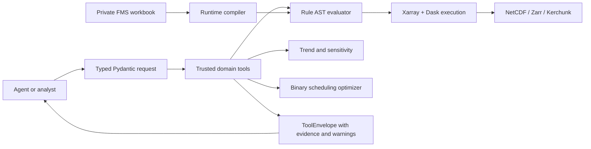

# Architecture

## System boundary

The agent is outside the trust boundary. It cannot submit arbitrary array code,
raw Dask graphs or a solver result. It selects a typed tool and receives a result
whose data version, constraints and warnings are explicit.

## Rule compilation

The workbook compiler processes all non-empty cells in each burn-class row:

1. comparisons (`<`, `<=`, `>`, `>=`) preserve endpoint semantics;
2. numeric ranges compile to inclusive lower and upper bounds;
3. explicit Victorian seasons compile to seasonal AST leaves;
4. ambiguous `Fallen` / `From Summer`, Day 2/3 semantics and anomalous values
   remain in `unresolved`;
5. unmapped fuel-moisture and ground-wind fields remain typed but are excluded
   from the core climate baseline unless explicitly enabled.

One prescription is an AND node over leaf conditions. Seasonal leaves are
neutral outside their active months. Missing variables follow the caller's
explicit policy; `error` is the default.

## Temporal correctness

For a daily value labelled with date `D`, the safe default makes it available at
`D + 24h`, then backward-only fills hourly targets. A configurable maximum age
prevents indefinite propagation. This avoids using a same-day aggregate before
the day has finished. A zero-hour lag is allowed only if data documentation says
the source timestamp is the observation's actual availability time.

Irregular hourly gaps split continuous windows. A six-record run with a missing
hour is therefore not a six-hour operational window.

## Large-data execution

- NetCDF uses `open_mfdataset(combine="by_coords", parallel=True)`.
- Zarr opens consolidated or unconsolidated stores through one adapter.
- Kerchunk references virtualise HDF5/NetCDF files without copying payloads.
- Time-first chunks default to one week; spatial chunks are configurable after
  inspecting the on-disk chunks and task graph.
- The 1972–2024 Slurm array runs one year per checkpoint, so interrupted years
  can be resubmitted without recomputing completed metrics.

The scaling script is intentionally synthetic. Real scaling evidence requires
the same year, burn class, storage path and chunk configuration at 1/2/4 workers.

## Scheduling formulation

Each candidate window has a binary selection variable and a scenario utility:

`area × robustness + quality − mobilisation_cost`.

Constraints cover concurrent crew capacity, optional daily operation capacity
and minimum window duration. SciPy HiGHS solves the binary linear programme;
small tests use an exact enumerative fallback when SciPy is absent. The selected
set is revalidated independently. Objective units are scenario utility, never
reported as realised money or risk reduction.

The robust extension adds one continuous lower-bound variable `z` and one row
per planning scenario: `z <= Σ utility[scenario,candidate] × selected[candidate]`.
Maximising `z` produces a max-min schedule. Held-out simulations evaluate the
fixed selections; they do not turn scenario utility into a forecast or currency.

