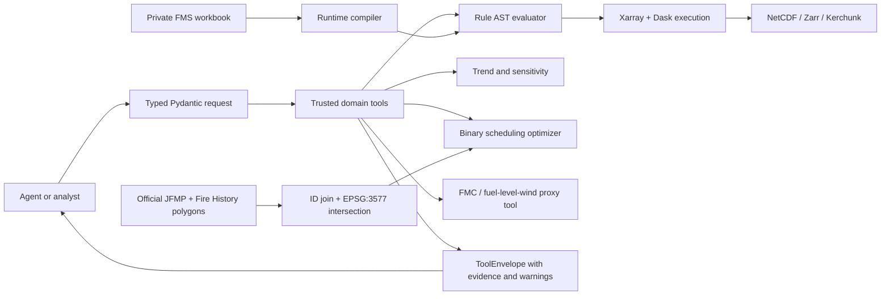
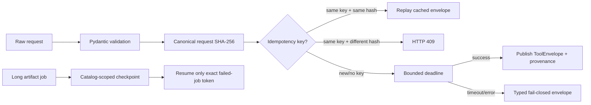

# Architecture

## System boundary

The agent is outside the trust boundary. It cannot submit arbitrary array code,
raw Dask graphs or a solver result. It selects a typed tool and receives a result
whose data version, constraints and warnings are explicit.

The service boundary is also typed: callers discover schemas with
`GET /api/tools`, invoke only declared operations at
`POST /api/tools/{tool_name}:invoke`, and submit long burn-unit aggregation work
through an artifact-catalog-backed asynchronous job endpoint. Each response is
a `ToolEnvelope` 1.1 with status, data version, source, constraints, warnings,
typed result/error, trace ID, request/code provenance and execution metadata.
Unknown arguments, artifact IDs and arbitrary paths fail before domain code
runs.

### Execution reliability contract

The six domain-tool invocations are bounded and stateless. Their checkpoint
mode is therefore `not_applicable_stateless`; an idempotent retry replays the
same validated request rather than resuming internal computation. The separate
burn-unit climatology job is artifact-backed and may expose a checkpoint. A
resume request must match both the failed parent job and its exact checkpoint
token, preventing a caller from substituting an arbitrary path or partial
state.

Timeout means the service will not publish a late result. The underlying Python
thread may finish after the response deadline, so this boundary is fail-closed
result publication rather than hard process termination. Deployments that need
hard cancellation must place tools in cancellable worker processes or batch
jobs.

`data_version` is caller-supplied: the envelope labels a specific value
`caller_asserted` and an empty/unknown value `incomplete`. It does not claim the
service independently audited the caller's data. Full restricted-data evidence
still requires a manifest with source hashes and quality gates.

## Rule compilation

The workbook compiler processes all non-empty cells in each burn-class row:

1. comparisons (`<`, `<=`, `>`, `>=`) preserve endpoint semantics;
2. numeric ranges compile to inclusive lower and upper bounds;
3. explicit Victorian seasons compile to seasonal AST leaves;
4. ambiguous `Fallen` / `From Summer`, Day 2/3 semantics and anomalous values
   remain in `unresolved`;
5. the historical core baseline still excludes unavailable fuel-moisture and
   fuel-level-wind fields; an explicit proxy mode promotes only surface FMC and
   fuel-level wind after adding model provenance, rain guards and a declared
   wind-reduction factor.

One prescription is an AND node over leaf conditions. Seasonal leaves are
neutral outside their active months. Missing variables follow the caller's
explicit policy; `error` is the default.

## Burn-unit and outcome geometry

The public adapter pages through the official JFMP and Fire History ArcGIS
layers, validates required attributes and hashes the complete ordered response.
Records are joined only on the official treatment/fire identifier. GeoJSON
polygons are projected to EPSG:3577, duplicate records are removed, multipart
features are unioned and intersections are recomputed locally. The attribute
area ratio and geometry overlap are both reported because staged and repeated
burns can make a single ratio misleading.

The resource layer uses FFMVic's published staffing ranges as discrete scenarios
and the latest statewide direct planned-burning investment divided by treated
area as an AUD/ha scale benchmark. Neither enters the safety evaluator, and both
carry `proxy` semantics through the tool envelope and evidence ledger.

## Temporal correctness

For a daily value labelled with date `D`, the safe default makes it available at
`D + 24h`, then backward-only fills hourly targets. A configurable maximum age
prevents indefinite propagation. This avoids using a same-day aggregate before
the day has finished. A zero-hour lag is allowed only if data documentation says
the source timestamp is the observation's actual availability time.

Irregular hourly gaps split continuous windows. A six-record run with a missing
hour is therefore not a six-hour operational window.

## Large-data execution

- NetCDF uses `open_mfdataset(combine="by_coords", parallel=False)` inside
  each annual process. Concurrency is supplied by the Slurm year array; this
  avoids inheriting the physical node's 128-core thread count and protects the
  mixed NetCDF3/HDF5 collection from unsafe in-process open/read concurrency.
- Zarr opens consolidated or unconsolidated stores through one adapter.
- Kerchunk references virtualise HDF5/NetCDF files without copying payloads.
- Time-first chunks default to one week; spatial chunks are configurable after
  inspecting the on-disk chunks and task graph.
- The file-backed 1973–2023 Slurm array runs one year per checkpoint, so interrupted years
  can be resubmitted without recomputing completed metrics.
- Each post-1973 year loads five hours of prior context before calculating
  2/4/6-hour endpoints. The first day of 1973 is explicitly left-censored
  because December 1972 daily KBDI/drought-factor state does not exist.
- Scalar counts and duration endpoints share one Dask reduction graph. The
  production request (1 CPU, 8 GiB, 20 minutes) is derived from semantic-equal
  annual pilots rather than copied from the node shape.

The scaling script is intentionally synthetic. Real scaling evidence requires
the same year, burn class, storage path and chunk configuration at 1/2/4 workers.

## Scheduling formulation

Each candidate window has a binary selection variable and a scenario utility:

`area × robustness + quality − mobilisation_cost`.

Constraints cover concurrent crew capacity, optional daily operation capacity
and minimum window duration. SciPy HiGHS solves the binary linear programme;
small tests use an exact enumerative fallback when SciPy is absent. The selected
set is revalidated independently. Objective units are scenario utility, never
reported as realised money or risk reduction.

For Agent explanations, rejected candidates are classified as minimum-duration,
crew-capacity, daily-capacity or global-objective trade-offs. Capacity-conflict
records identify the selected blockers and a local replacement gap. The typed
tool also resolves the neighbouring integer crew capacities and reports their
objective deltas. These are discrete counterfactual diagnostics around the
model, not LP dual prices, causal estimates or currency.

The robust extension adds one continuous lower-bound variable `z` and one row
per planning scenario: `z <= Σ utility[scenario,candidate] × selected[candidate]`.
Maximising `z` produces a max-min schedule. Held-out simulations evaluate the
fixed selections; they do not turn scenario utility into a forecast or currency.

The CVaR extension uses a free quantile variable plus one non-negative shortfall
variable per scenario. At `alpha=0.8`, the objective maximises empirical mean
utility in the worst 20% of 40 independently sampled planning scenarios. Its
fixed selection is then evaluated on 200 separately seeded scenarios per run.
This reduces single-worst-case conservatism while preserving a visible risk
parameter and an auditable linear formulation.

